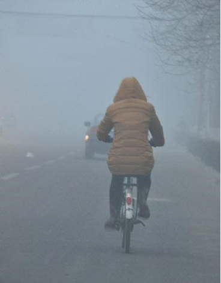
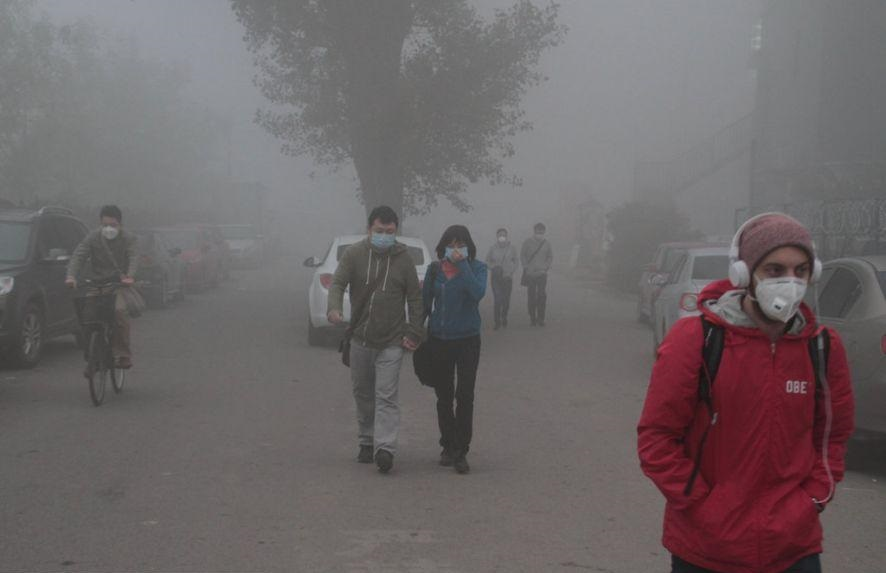
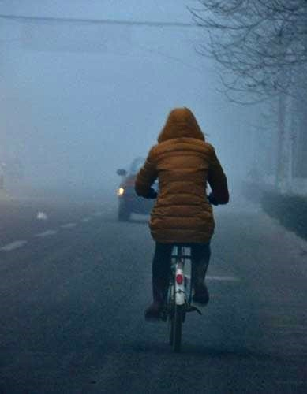
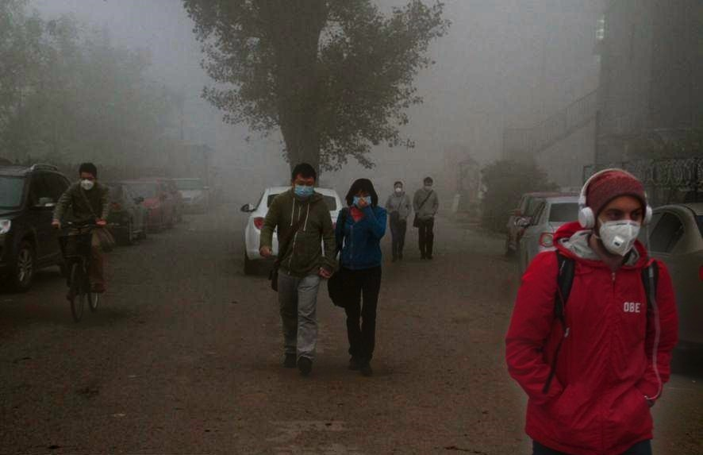
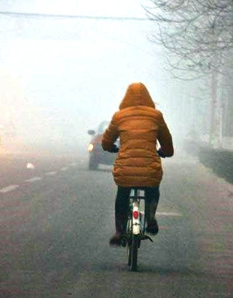
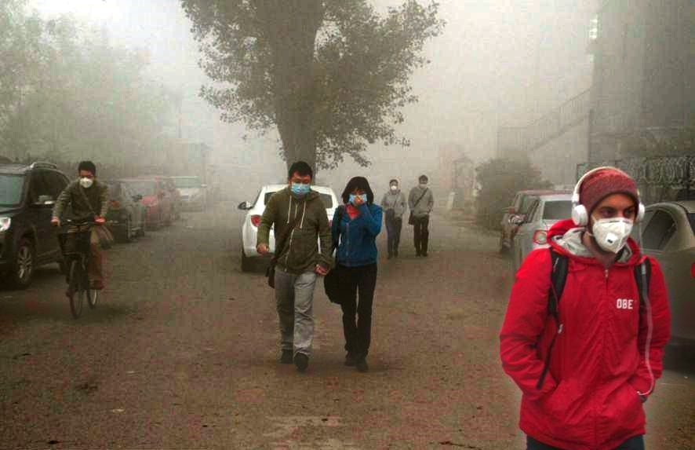

# Natural Light Fog Model for Image Defog in Adverse Weather Conditions

## Project Overview

This project focuses on enhancing images captured in foggy weather conditions to improve their clarity and usability. The project introduces a new fog model and applies it to traditional defogging algorithms to process foggy images, enhancing their visual quality.

## Background

Image enhancement aims to highlight important information in images while suppressing or removing unnecessary details. This is crucial in various fields such as medical diagnosis, military reconnaissance, fingerprint recognition, non-destructive testing, and satellite imagery processing. Image enhancement can help overcome the challenges posed by adverse weather conditions, such as fog, by improving the visibility of the captured images.

## Research Status

Traditional fog models fail to consider the impact of various weather conditions on the atmospheric light shining on objects. Our project builds on existing research, such as the Rayleigh scattering theory and Mie scattering theory, to develop a more accurate fog model that addresses the shortcomings of traditional approaches.

## Project Description

### Methodology

1. Analyze the principles of traditional fog models and identify their limitations.
2. Develop a new fog model that addresses these limitations.
3. Apply the new model to traditional defogging algorithms.
4. Validate the new model through extensive testing and comparison with existing methods.

### Innovation

Our primary innovation lies in the development of a more accurate fog model for image enhancement. Unlike traditional methods that do not account for the causes of image quality degradation, our model adjusts for the effects of atmospheric light and provides more realistic and clearer images.

### Feasibility

The most commonly used fog model is I(x)=J(x)t(x)+A(1-t(x)), where:
- I is the observed foggy image,
- J is the image without fog under foggy atmospheric light condiiton,
- t is the transmission map,
- A is the atmospheric light.

Our model introduces a correction factor to better account for the effects of atmospheric light and improve image clarity. I(x)=AJ(x)t(x)/255+A(1-t(x)), 
where:
- I is the observed foggy image,
- J is the image without fog under perfect light condition,
- t is the transmission map,
- A is the atmospheric light.

## Results

We applied our model to the most commonly used dark channel defogging method and compaired with state-of-the-art defogging methods on the BeDDE dataset. Our approach achieved superior results, demonstrating the effectiveness of the new fog model.

### Quantitative Comparison

| Method        | VI    |
|---------------|-------|
| FVR           | 0.8054|
| BayD          | 0.8294|
| CAP           | 0.8507|
| NLD           | 0.8278|
| MSCNN         | 0.8920|
| DehazeNet     | 0.8902|
| AOD-Net       | 0.8961|
| DCPDN         | 0.8940|
| GFN           | 0.8659|
| DisentGAN     | 0.8678|
| PQC           | 0.8923|
| EPDN          | 0.8960|
| GridDehazeNet | 0.8837|
| **Mine**      | **0.8966** |

### Visual Comparison

Here are some visual comparisons of the results:

### Visual Comparison

#### Original Images

  
  

#### Traditional Method

  
  

#### My Method

  
  

## Conclusion and Future Work

Our method fundamentally explores the principles and derivation process of fog models, correcting errors in traditional models and validating the accuracy and advanced nature of our new model through extensive testing. Future work will focus on enhancing defogging techniques for different adverse weather conditions, where the variability in light intensity poses significant challenges.

## Acknowledgements

This project was supported by the Tongji University's technology innovation practice program.